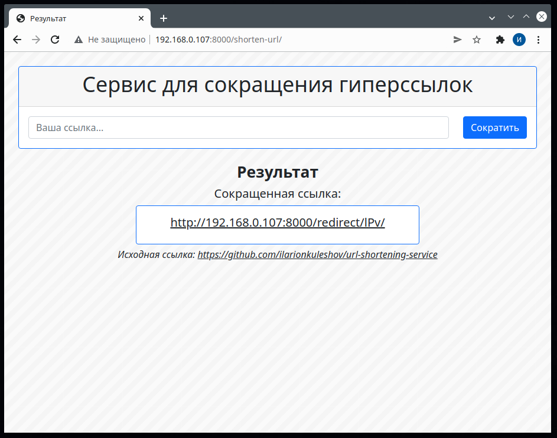

# URL Shortening Service

Сервис для сокращения гиперссылок в браузере и с помощью API.

<p align="center">
	
</p>

## Использование API

API эндпоинт: _/api/_

Запрос POST c параметром initial_url создает сокращенную ссылку и возвращает short_url.

Запрос GET c параметром short_url возвращает статистику переходов по сокращенной ссылке.

Запрос DELETE c параметром short_url удаляет сокращенную ссылку.

## Установка необходимых библиотек / модулей

```
pip install -r requirements.txt
```